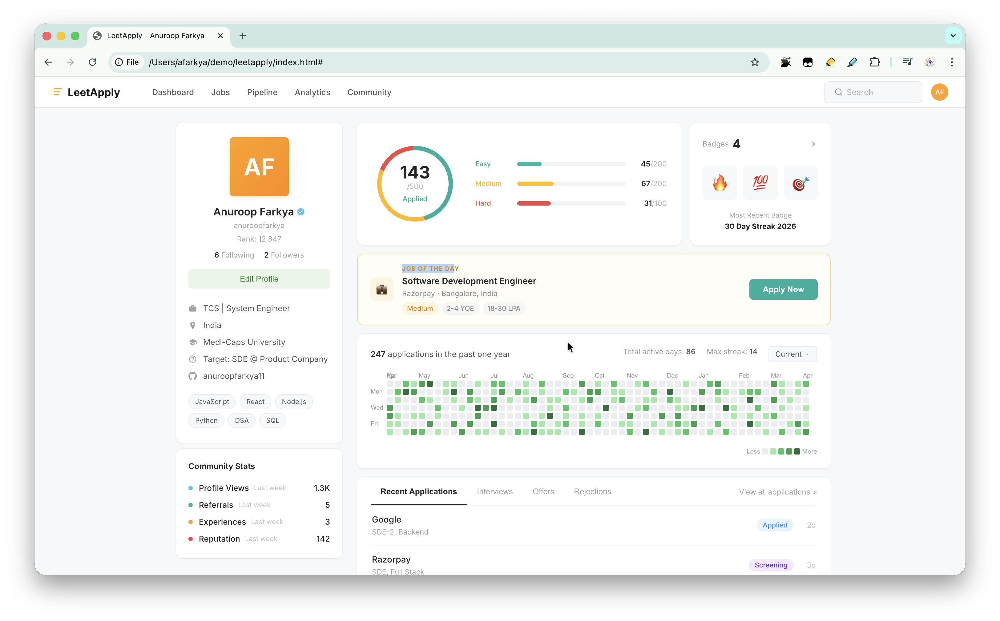
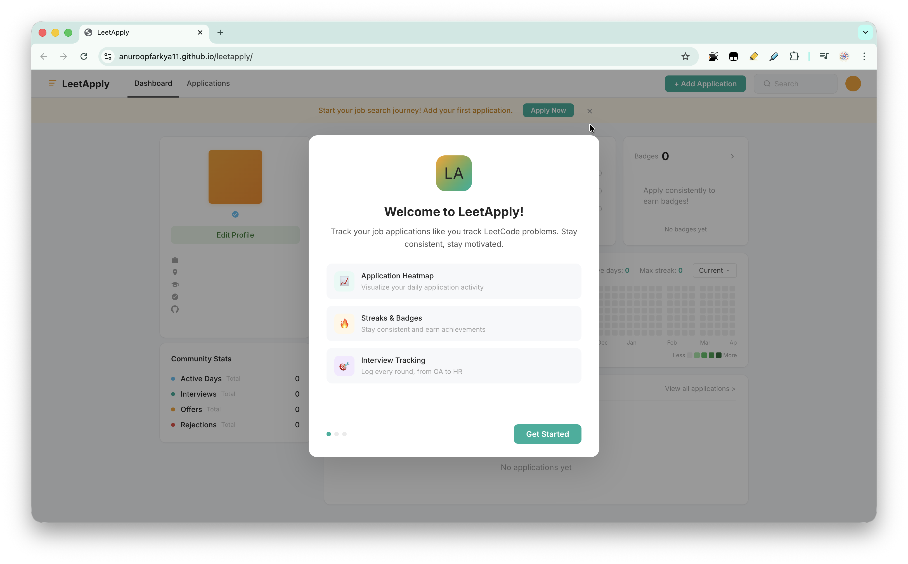

# LeetApply

**LeetCode-style job application tracker.** Gamify your job search with streaks, heatmaps, badges, and progress rings — just like LeetCode did for DSA practice.

**Live:** [anuroopfarkya11.github.io/leetapply](https://anuroopfarkya11.github.io/leetapply/)

## Why LeetApply?

Job seekers apply to dozens of companies daily but have no system to track progress, stay consistent, or visualize their journey. LeetApply brings LeetCode's proven gamification — streaks, heatmaps, difficulty ratings — to the job search.

## Features (v1.0)

### Onboarding
- 3-step welcome wizard for first-time users
- Set up your profile — name, company, university, target role, skills
- Personalized dashboard from the start

### Dashboard
- **Application Heatmap** — GitHub/LeetCode-style green squares showing daily activity
- **Progress Ring** — SVG donut chart with Easy/Medium/Hard breakdown
- **Streak System** — Current streak, max streak, and streak warnings to keep you consistent
- **Badges** — Earn badges for milestones: 7-day streak, 30-day streak, 50 apps, 100 apps, first interview, first offer
- **Community Stats** — Active days, interviews, offers, rejections at a glance
- **Recent Activity** — Tabs for recent applications, interviews, offers, rejections

### Application Management
- Add, edit, filter, and search applications with inline status updates
- Track across LinkedIn, Naukri, Indeed, Internshala, Wellfound, Direct, and Referral
- Status flow: Applied → Screening → Interview → Offer / Rejected
- Difficulty ratings: Easy, Medium, Hard

### Interview Round Tracking
- Log round-by-round interview progress per application
- Round types: OA, Phone Screen, DSA, System Design, Machine Coding, HR, Hiring Manager
- Track outcomes: Pending, Cleared, Failed, Ghosted

## Tech Stack

- Plain HTML, CSS, JavaScript — no frameworks, no build step
- localStorage for data persistence
- Hand-coded SVG for heatmap and progress ring
- Deployed on GitHub Pages

## Getting Started

Just open `index.html` in your browser. No installation needed.

## Author

**Anuroop Farkya** — [@AnuroopFarkya11](https://github.com/AnuroopFarkya11)